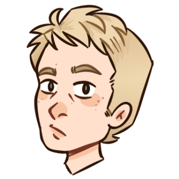

<!-- PROJECT LOGO -->
<br />
<div align="center">
  <a href="https://github.com/NilsCarron/HabilityARDemo/tree/main/Assets/Images/Icon/logo.png">
    
  </a>

<h3 align="center">HabilityARDemo</h3>

  <p align="center">
    AR mobile minigame made for <a href="https://hability.fr/">H'ability</a> as a technical test
    <br />
    The game is a platformer, that starts once you scan H'ability's logo
    <br/>
    You'll have to guide the monkey to collect all the bananas
    <br />
    <a href="https://github.com/github_username/repo_name">View Demo</a>
     - <a href="https://drive.google.com/drive/folders/1sdjD_LkQMFe7bGY13JxuO0yhPJh6Ix2w?usp=sharing">Download Demo</a>

  </p>
</div>


<!-- TABLE OF CONTENTS -->
<details>
  <summary>Table of Contents</summary>
  <ol>
    <li>
      <a href="#about-the-project">About The Project</a>
      <ul>
        <li><a href="#built-with">Built With</a></li>
      </ul>
    </li>
    <li>
      <a href="#getting-started">Getting Started</a>
      <ul>
        <li><a href="#prerequisites">Prerequisites</a></li>
        <li><a href="#installation">Installation</a></li>
      </ul>
    </li>
    <li><a href="#usage">Usage</a></li>
    <li><a href="#known-bugs">known bugs</a></li>
    <li><a href="#contact">Contact</a></li>
  </ol>
</details>
##readme-top


<!-- ABOUT THE PROJECT -->
## About The Project

[![Product Name Screen Shot][product-screenshot]](https://example.com)

Here's a blank template to get started: To avoid retyping too much info. Do a search and replace with your text editor for the following: `github_username`, `repo_name`, `twitter_handle`, `linkedin_username`, `email_client`, `email`, `project_title`, `project_description`


### Built With
[](https://unity3d.com)
#### API Used
<a href="https://developer.vuforia.com/"> Vuforia</a>
 
   


<!-- GETTING STARTED -->
## Getting Started

To use this project as a developer you need to install a bunch of plug-in in Unity
As a player, you will just need to download the demo

### Prerequisites

If you are a player or a developer you will need Android with an API level above 29 (Android 10 or above)

### Installation

#### As a Player
Just Download the game <a href="https://drive.google.com/drive/folders/1sdjD_LkQMFe7bGY13JxuO0yhPJh6Ix2w?usp=sharing">here</a>
<br>
Play the game as portrait, not as landscape.

#### As a developper
First download Unity, the project uses Unity 2022.2.10.f.1
Then, pass your Phone to Developper mode, and plug it in

1. Get a free API Key at [https://developer.vuforia.com/](https://developer.vuforia.com/)
2. Clone the repo
   ```sh
   git clone https://github.com/NilsCarron/HabilityARDemo.git
   ```
3. Install vuforia

4. Enter your API key in the project Assets -> Scenes -> MazeScene -> ARCamera -> Open Vuforia_Configuration -> App Licence Key

5. Go to "Build Settings" select your phone as device, and "Build And run"


<!-- USAGE EXAMPLES -->
## Usage

### Nomenclature of the project :

### The project has 5 main folders :

#### Images
This Folder contains images for the UI, and also the materials that will be used on the models.

#### Models
Contains the models for the players, as wall as its animations, animator and the models of the scenery

#### Prefabs
Here are the actors that can be put directly into the game, such as objectives
#### Scenes
This scenes are the ones used in the game, the wellcome scene and the game one
#### Scripts
This folder is the most important, and contains all the scripts in the game except the GameManager, wich is directly in the Assets folder

### Scripts usage :
Since there is very few files, it is easy to describe each 

#### IntroUpDisplay :
This script is linked to the canvas in the 1st screen, it displays wellcome message and load the 2nd scene
#### JoystickController :
This script is linked to the canvas of the 2nd scene, it recieve the inputs of the player, and translate it into vectors and send it in the PlayerController
This script needs a lot of balancing, because with bad scaling, the monkey will move very slowly or too fast.
This scripts also turns the player so it looks to the right direction
#### PlayerController :
The playerController has 2 roles :
It moves the player around with the inputs of the JoystickController, and translates the player model in consequence.
Its second role is to detect collisions, mainly the ground (to detect if the player can jump) but also the collision with the objectives
In such a case, the script destroys the objective and add to the player's score with the GameManager
#### PhysicManager :
The PhysicManager apply artificial gravity to the rigidbody of the player, so it goes to the AR ground, but also rotate the player,
so his feets are always on this AR ground
## GameManager
This manager is really usefull, since it can end the game, and display the time the player has played (which is his final score) and also save it into the phone.
the GameManager will also count the numbers of objectives the player obtained.
Finnally this script displays the final message and reset the game


<!-- known-bugs -->
## known-bugs

* The monkey is too fast
This can be due to a Landscape rotation mode on the phone
* The is a Black Screen
This is due to your Android verion that is under 10 or the authorization to use the camera
* The monkey doesn't appear (anymore) on the screen
This is probably due to the monkey going so fast it goes out of the borders, or inside a wall
See Bug number 1


<!-- CONTACT -->
## Contact
[![LinkedIn][linkedin-shield]][linkedin-url]

[![github][github-shield]][github-url]
<br/>
![gmail][gmail-shield] : carronnils@gmail.com
<br/>


<!-- MARKDOWN LINKS & IMAGES -->
<!-- https://www.markdownguide.org/basic-syntax/#reference-style-links -->
[contributors-shield]: https://img.shields.io/github/contributors/github_username/repo_name.svg?style=for-the-badge
[contributors-url]: https://github.com/github_username/repo_name/graphs/contributors
[forks-shield]: https://img.shields.io/github/forks/github_username/repo_name.svg?style=for-the-badge
[forks-url]: https://github.com/github_username/repo_name/network/members
[stars-shield]: https://img.shields.io/github/stars/github_username/repo_name.svg?style=for-the-badge
[stars-url]: https://github.com/github_username/repo_name/stargazers
[issues-shield]: https://img.shields.io/github/issues/github_username/repo_name.svg?style=for-the-badge
[issues-url]: https://github.com/github_username/repo_name/issues
[license-shield]: https://img.shields.io/github/license/github_username/repo_name.svg?style=for-the-badge
[license-url]: https://github.com/github_username/repo_name/blob/master/LICENSE.txt

[gmail-shield]: https://img.shields.io/badge/Gmail-D14836?style=for-the-badge&logo=gmail&logoColor=white


[linkedin-shield]: https://img.shields.io/badge/-LinkedIn-black.svg?style=for-the-badge&logo=linkedin&colorB=555
[linkedin-url]: https://linkedin.com/in/nils-carron-431155196

[github-shield]: https://img.shields.io/badge/github-%23121011.svg?style=for-the-badge&logo=github&logoColor=white
[github-url]: https://github.com/NilsCarron


[product-screenshot]: images/screenshot.png


[Next.js]: https://img.shields.io/badge/next.js-000000?style=for-the-badge&logo=nextdotjs&logoColor=white
[Next-url]: https://nextjs.org/

[Unity.cs]: https://img.shields.io/badge/Made%20with-Unity-57b9d3.svg?style=flat&logo=unity


